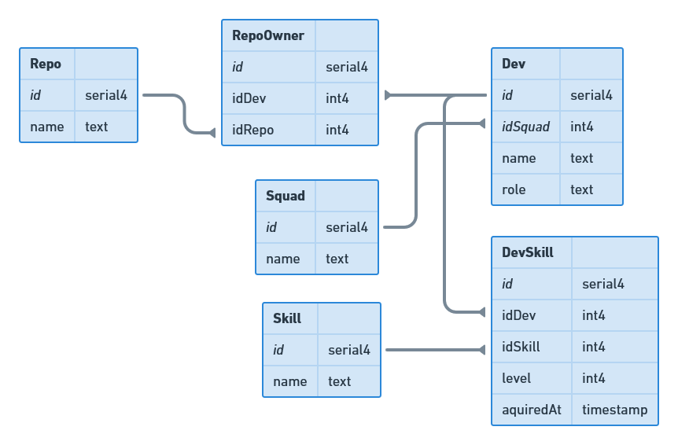

# 🥇 DevFriends backend bootstrapper

Here is a project to do some backend stuffs. Let's have some fun! ✨

[](https://open.vscode.dev/jpb06/dev-friends-backend-starter)

## ⚡ Requirements

You will need the following to work on this workshop:

| Item      | Description                                              | Documentation                               |
| --------- | -------------------------------------------------------- | ------------------------------------------- |
| ⚙️ nodejs | Duh!                                                     | https://nodejs.org/en/                      |
| 🐳 Docker | we will use docker to launch a postgres instance         | https://www.docker.com/get-started          |
| 🧶 yarn   | We will use yarn as the package manager for this project | https://yarnpkg.com/getting-started/install |

## ⚡ Stack

| Item          | Description                                                                     | Documentation                                      |
| ------------- | ------------------------------------------------------------------------------- | -------------------------------------------------- |
| 🤩 Typescript | Types, types everywhere                                                         | https://www.typescriptlang.org/docs/               |
| 🖊️ eslint     | Linting all the things!                                                         | https://eslint.org/docs/user-guide/getting-started |
| 😹 nestjs     | Nest is a cool framework to build backends (brace yourself, decorators inbound) | https://docs.nestjs.com/                           |
| 🛆 prisma      | Prisma will be our ORM to interract with the database                           | https://www.prisma.io/docs/getting-started         |
| 🃏 jest       | We will use jest to write our tests                                             | https://jestjs.io/fr/docs/getting-started          |

## ⚡ How to start

### 🔶 Firstof, let's start our database using docker

```bash
yarn start:db
```

### 🔶 Launching our tests

```bash
yarn test:watch
```

### 🔶 Launching our backend in dev mode

```bash
yarn start:dev
```

### 🔶 Building our app for production

```bash
yarn build
```

## ⚡ Data model

Our sample database contains developers along with their squads, their skills and their ownerships on repositories.

Let's take a look at the schema:



## ⚡ Give me features to complete now!

### 🔶 Guidelines

| Guideline                       | Description                                                                                   |
| ------------------------------- | --------------------------------------------------------------------------------------------- |
| 💪 Use only typescript          | No javascript allowed!                                                                        |
| 💪 Be modular                   | nestjs is based on the same principles as angular. Remember modules are cool!                 |
| 💪 Follow RESTful principles    | Define your endpoints in the most logical way from these principles                           |
| 💪 Make sure to validate inputs | Endpoints should return a specific response when input is invalid                             |
| 💪 Standardize responses        | If a resource is not found, return a 400 response, if something goes wrong, return a 500, etc |
| 💪 Test your code               | Make sure the codebase is properly tested                                                     |

<hr>

### 🔶 1) Provide an endpoint to get all squads with their developers

This endpoint should return an array of objects containing squads data and an array of developers.

You will have to use prisma to generate a model; you will then be able to use prisma client to interact with the database.

#### ✅ Expected output

```
{
  result: [
    {
      id: number,
      name: string,
      devs: [
        {
          id: number,
          name: string,
          role: string
        }
      ]
    },
    // ...
  ]
}

```

<hr>

### 🔶 2) Provide an endpoint to get a developer

This endpoint should return an object containing the dev infos as well as his squad, his skills and his ownerships.

#### ▶️ Input

```
developer id (number)
```

#### ✅ Expected output

```
{
  result: {
    id: number,
    name: string,
    squad: {
      id: number,
      name: string,
    },
    skills: [
      {
        id: number,
        name: string,
        level: number,
        aquiredAt: Date
      },
      // ...
    ],
    ownerships: [ // repos
      {
        id: number,
        name: string
      },
      // ...
    ]
  }
}
```

<hr>

### 🔶 3) Provide an endpoint to get all the developers matching a skill

By providing the id of a skill, we expect to get the developers who aquired this skill.

#### ▶️ Input

```
skill id (number)
```

#### ✅ Expected output

```
{
  result: [
    {
      id: number,
      name: string,
      level: number,
      aquiredAt: Date
    }
    // ...
  ]
}
```

<hr>

### 🔶 4) Provide an endpoint to change the squad of a developer

This endpoint should change the squad of a developer and return the developer.

#### ▶️ Input

```
developer id (number)
```

#### ✅ Expected output

```
{
  result: {
    id: number,
    name: string,
    squad: {
      id: number,
      name: string,
    },
  }
}
```

<hr>

### 🔶 5) Provide an endpoint to update the owner of a repo

This route is a tricky one. We want to change the owner of a repo by picking, within a squad, the developer having the most experience in a list of skills. If no developer stands out from the crowd, then we shall choose by order of precedence the champion or the squad owner.

#### ▶️ Input

```
{
  idRepo: number,
  idSquad: number,
  skills: number[]
}
```

#### ✅ Expected output

```
{
  result: boolean
}
```

<hr>

### 🔶 6) Add swagger to the stack and fully document each route

We want more documentation! Let's setup a swagger on our api to make sure routes can be easily interacted with and understood.

#### ✅ Expected result

- Inputs should be documented
- Outputs (possible responses) should all be documented
- A description of the route should be present

<hr>

### 🔶 7) Provide an endpoint to authenticate users

This feature implies to alter the database and its model in order to store a login and a password for each user.

As for the login route:

#### ▶️ Input

```
{
  login: string,
  password: string
}
```

#### ✅ Expected output

```
{
  result: {
    token: string
  }
}
```

<hr>

### 🔶 8) Secure all the routes

Let's secure our api now! All our routes should be restricted to logged users.

#### ✅ Expected result

All our routes should now require authentication. A proper response should be returned if the caller is unauthorized.
